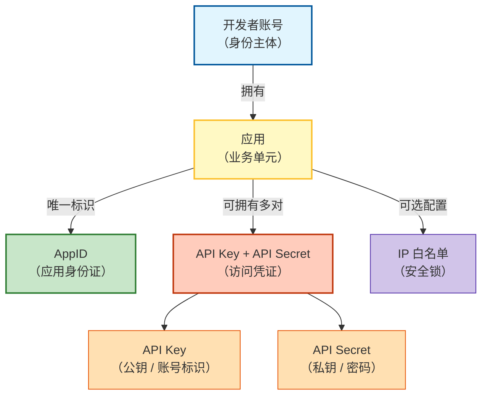

# 讯飞开放平台：AppID、API Key、API Secret 与开发者账号的关系

在讯飞开放平台中，开发者账号、应用、AppID、API Key 和 API Secret 共同构成了一套清晰、安全的身份与访问管理体系。理解它们之间的关系，是正确集成讯飞 AI 能力的基础。

## 📊 关系总览图



## 🔑 逐层解析

### 1. 开发者账号 —— 你的身份主体

- **作用**：你在讯飞开放平台的合法身份。只有完成注册并实名认证（个人或企业）的账号，才能创建应用、获取凭证。
- **管理范围**：账号下可以拥有多个应用，管理团队、财务、订单等。

### 2. 应用 —— 业务逻辑单元

- **作用**：对应一个具体的产品、项目或服务（例如“智能语音助手”、“视频字幕生成器”）。
- **为什么需要应用**：隔离不同项目的资源和计费，便于权限管理和监控。

### 3. AppID —— 应用的唯一身份证号

- **格式**：一串数字或字母组合（如 `5b7e8f9a`）。
- **用途**：
  - 让讯飞后端识别请求来自哪个应用。
  - 用于路由、计费归属、日志查询。
- **公开性**：相对公开（可以出现在客户端代码或请求头中），不涉及安全问题。

### 4. API Key + API Secret —— 访问凭证对

这是**最敏感的部分**，负责验证调用者的合法性。

| 术语 | 类比 | 特性 | 传输方式 |
| :--- | :--- | :--- | :--- |
| **API Key** | 账号 / 公钥 | 公开标识，用于定位凭证对 | 出现在请求参数或头中 |
| **API Secret** | 密码 / 私钥 | **绝密**，仅客户端和服务端知晓 | 从不在网络上明文传输，仅用于本地签名计算 |

#### 工作流程（简化版）
1. 客户端使用 `API Key` + 当前时间戳 + 随机数等 → 用 `API Secret` 通过 HMAC-SHA256 / MD5 等算法生成**签名**。
2. 发送请求时带上 `API Key` 和签名。
3. 讯飞服务端用相同的算法和存储的 `API Secret` 重新计算签名。
4. 签名一致 → 请求合法；否则拒绝。

## 🧩 为什么一个应用可以有多对 API Key / Secret？

这是优秀的安全设计，带来的好处远大于“多记一套密码”的成本。

| 场景 | 为什么需要独立密钥对 |
| :--- | :--- |
| **开发 / 测试 / 生产环境分离** | 各自使用不同密钥，互不影响。测试环境泄漏不会影响线上业务。 |
| **多人协作** | 每个开发者使用自己的 API Key，便于追踪问题，离岗时只需吊销其密钥。 |
| **权限粒度控制** | 可以为某个 Key 只授予“只读”权限，另一个 Key 授予“读写”权限。 |
| **密钥轮换** | 定期或怀疑泄漏时创建新密钥，并逐步停用旧密钥，实现零停机迁移。 |

## 🛡️ 安全配置 —— IP 白名单

除了密钥对，还可以为应用绑定 **IP 白名单**。

- **作用**：只允许白名单中的 IP 地址调用该应用的 API。即使 API Key / Secret 泄露，攻击者也无法从其他 IP 发起请求。
- **建议**：对于后端服务，务必配置固定的出口 IP 到白名单；对于移动端 / Web 端，则无法使用此功能（应结合其他风控手段）。

## ✅ 最佳实践总结

1. **绝不硬编码**  
   禁止在代码中直接写 `API Secret`。应使用环境变量、配置中心或密钥管理服务（如 HashiCorp Vault）。

2. **最小权限原则**  
   为不同用途的 API Key 分配必要的权限范围，避免使用全功能密钥做低敏感操作。

3. **定期轮换**  
   每 90~180 天更换一次 API Key / Secret，并在替换后及时下线旧密钥。

4. **监控与告警**  
   在控制台开启异常调用告警（如短时间内高频调用、来自异常地理位置的请求）。

5. **使用官方 SDK**  
   SDK 内部已封装签名流程，避免因自行实现签名算法错误导致鉴权失败。

## 🔄 关系总结表

| 概念 | 层级 | 唯一性 | 是否可重置 | 安全级别 |
| :--- | :--- | :--- | :--- | :--- |
| 开发者账号 | 顶层主体 | 全局唯一 | 不可重置（可注销） | 高 |
| 应用 | 项目单元 | 账号下唯一 | 可删除、新建 | 中 |
| AppID | 应用标识 | 全局唯一 | 不可重置（随应用） | 低（公开） |
| API Key | 凭证标识 | 应用下唯一 | 可重置 | 中（需保密） |
| API Secret | 签名密钥 | 与 Key 配对 | 可重置 | **极高** |

理解这五者的关系，不仅能让你快速接入讯飞开放平台，还能为你的产品构建一套稳健的 API 调用安全体系。

> 📌 提示：控制台操作时，任何涉及 `API Secret` 重置的操作都会导致旧密钥**立即失效**，请确保所有客户端已提前更新配置，以免服务中断。
```